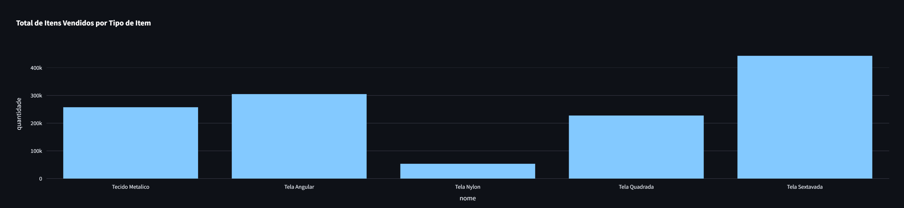
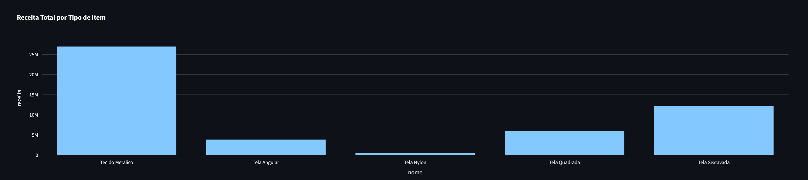
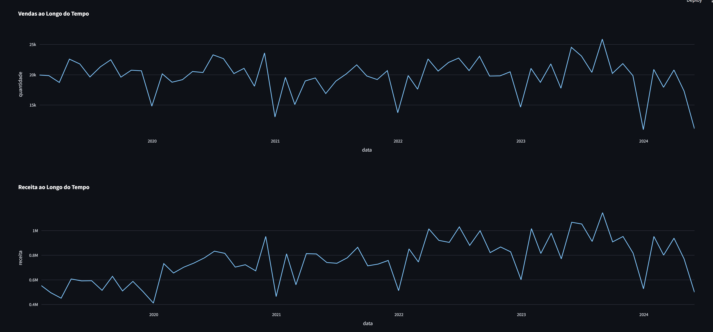
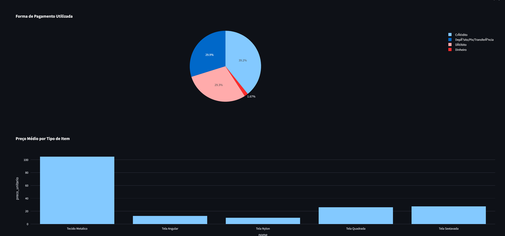
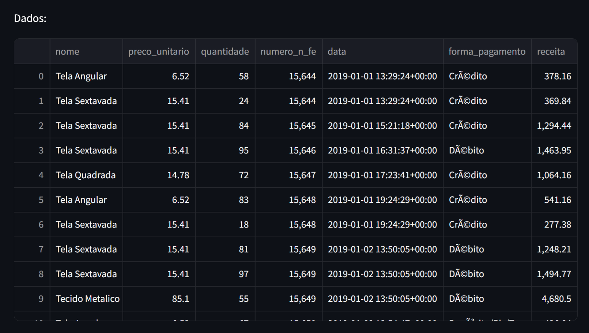

# Projeto Big Data Para Cliente Cital

Este é um projeto de Big Data para a disciplina `TÓPICOS DE BIG DATA EM PYTHON` da Univerisade Estácio de Sá, ministrada pelo docente Raphael Jesus. É um projeto que utiliza `streamlit`, `pandas` e `plotly` para visualizar dados da empresa `Cital`.

## Descrição

Estre projeto utiliza o Streamlit para criar uma aplicação web interativa que permite a visualização de dados a partir de um arquivo json de vendas de uma empresa de telas de arame.

## Funcionalidades

- Carregar dados de um arquivo JSON.
- Gerar visualizações interativas utilizando Plotly Express.

## Estrutura do Projeto

```.
├── assets
│ └── img1.png
│ └── img2.png
│ └── img3.png
│ └── img4.png
│ └── img5.png
├── controller
│ └── controller.py
├── data
│ └── cital_data.json
├── model
│ └── model.py
├── view
│ └── view.py
├── main.py
└── README.md
```

- **assets/**: Contém os arquivos de imagem usados pelo README.
- **controller/controller.py**: Contém a classe `ControladorCital` que coordena as operações entre o modelo e a visualização.
- **data/cital_data.json**: Arquivo JSON contendo os dados de vendas da cital.
- **model/model.py**: Contém a classe `ModeloCital` que lida com o carregamento e processamento dos dados.
- **view/view.py**: Contém a classe `VisualizacaoCital` que gera as visualizações dos dados.
- **main.py**: Script principal que executa a aplicação Streamlit.
- **README.md**: Documento explicativo do projeto.

## Instalação

1. Clone o repositório:

   ```bash
     git clone https://github.com/alunos-estacio-2023-01/cital-telas
     cd cital-telas
   ```

2. Crie um ambiente virtual e ative-o:

   python -m venv venv
   source venv/bin/activate # No Windows, use `venv\Scripts\activate`

3. Instale as dependências:

   ```bash
   pip install -r requirements.txt
   ```

## Executando a Aplicação

1. Certifique-se de que o arquivo cital_data.json está no diretório data.

2. Execute o script main.py com o Streamlit:

   ```python
   streamlit run main.py
   ```

3. Acesse a aplicação no seu navegador através do endereço indicado pelo Streamlit (geralmente <http://localhost:8501>).

## Detalhes do Código

### Modelo (model/model.py)

O modelo é responsável por carregar e preparar os dados.

- Classe ModeloCital:

  - `__init__(self, json_path)`: Carrega os dados do JSON e cria uma coluna de receita.

  - `obter_total_por_item(self)`: Obtem o total vendido de cada item.

  - `obter_receita_por_item(self)`: Obtem a receita bruta de cada item.

  - `obter_vendas_por_data(self)`: Obtem a quantidade de material vendida por mês.

  - `obter_receita_por_data(self)`: Obtem a receita total por mês.

  - `obter_forma_pagamento(self)`: Obtem informações sobre as formas de pagamento.

  - `obter_preco_medio_por_item(self)`: Obtem o preço médio dos itens no período presente no arquivo JSON.

### Visualização (view/view.py)

A visualização é responsável por gerar gráficos interativos.

- Classe VisualizacaoCital:

  - `exibir_pagina(self, dados...)`: Gera e exibe os gráficos interativos usando Plotly Express.

### Controlador (controller/controller.py)

O controlador coordena as interações entre o modelo e a visualização.

- Classe ControladorCital:

  - `__init__(self, json_path)`: Inicializa o modelo e a visualização.

  - `executar(self)`: Executa as operações necessárias, incluindo cálculos e geração de gráficos.

### Aplicação (main.py)

O script principal que configura e executa a aplicação Streamlit.

## Contribuição

- Contribuições são bem-vindas! Sinta-se à vontade para abrir issues ou pull requests.

## ScreenShot










